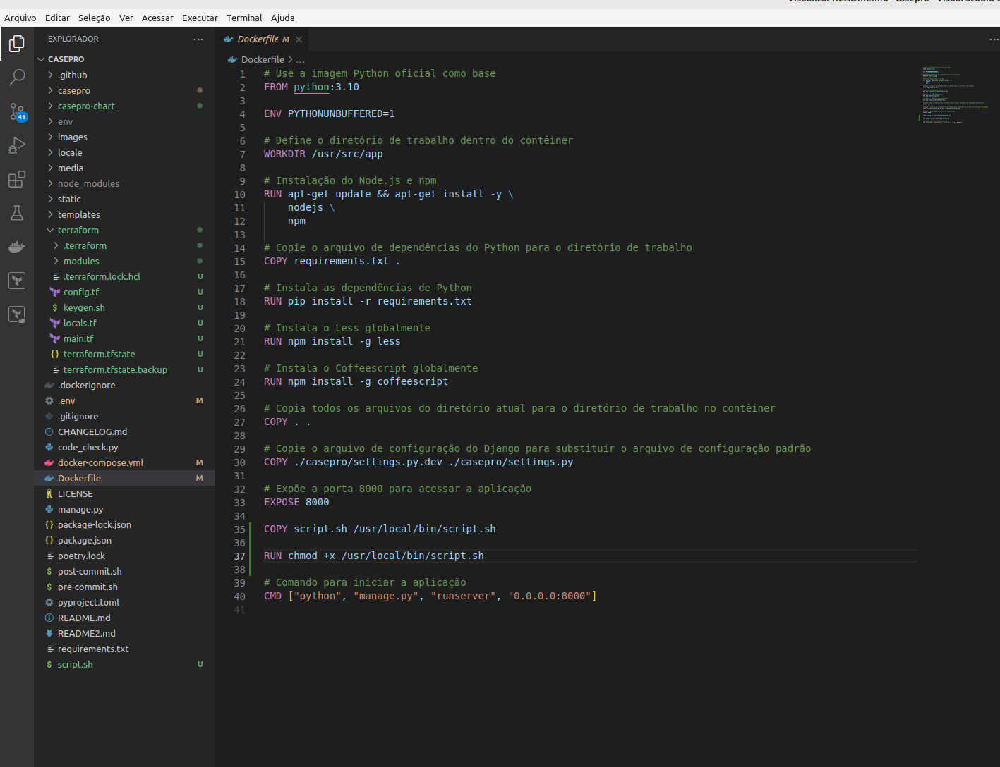
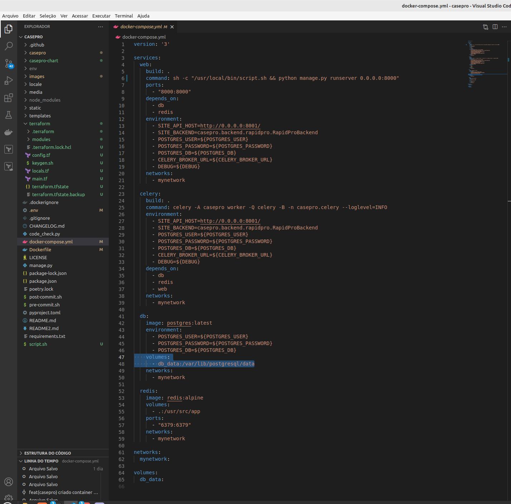
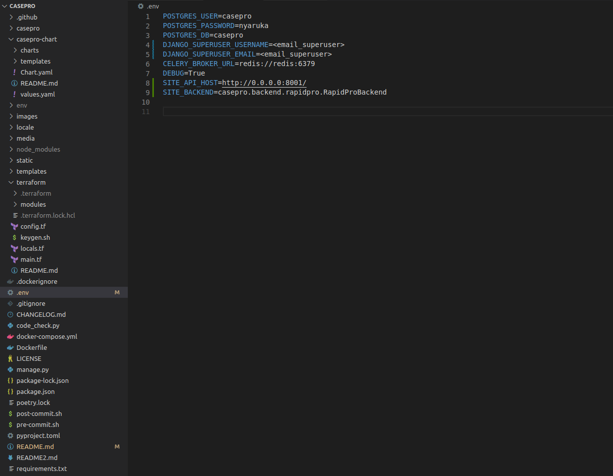
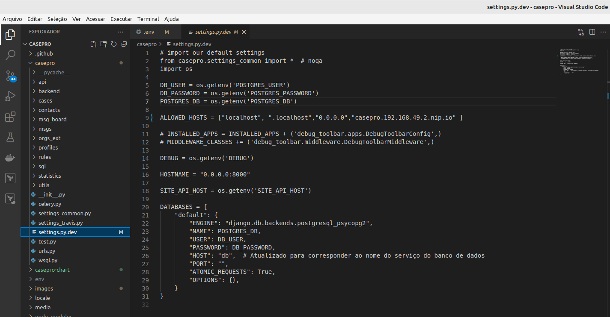

# Serviço CasePro Dockerizado

Este repositório contém as configurações necessárias para executar o serviço CasePro em um ambiente Dockerizado.

## Requisitos

- Docker
- Docker Compose

## Instalação

1. Clone este repositório:

    ```bash
    git clone git@github.com:Lucasbahr/casepro.git
    ```

2. Construa e execute os contêineres Docker usando o Docker Compose:

    ```bash
    docker-compose up --build
    ```

3. Acesse o serviço CasePro em seu navegador através do seguinte link: [http://localhost:8000](http://localhost:8000)

## Detalhes da Configuração

### Dockerfile do Serviço CasePro

O [Dockerfile](Dockerfile)  contém as instruções para criar a imagem Docker do serviço CasePro. Ele utiliza a imagem Python e instala o Node.js e o npm para instalar as dependências do Node.



### Docker Compose

O arquivo [docker-compose.yml](docker-compose.yml) define os quatros serviços necessários para executar o CasePro: web, db (PostgreSQL), redis e celery. Também configura uma rede para permitir a comunicação entre esses serviços e cria volumes persistentes para o banco de dados. As variáveis são consumidas do arquivo [.env](.env).



### Variáveis de Ambiente

As variáveis de ambiente são utilizadas para configurar o serviço CasePro. Um arquivo [.env](.env) é fornecido para definir as variáveis necessárias, incluindo informações de usuário e email, bem como as credenciais do banco de dados e algumas configuracoes.



### Configuração do Banco de Dados

No arquivo [settings.py](casepro/settings.py), a configuração do banco de dados foi ajustada para apontar para o próprio container do banco de dados, garantindo que o serviço CasePro consiga se comunicar corretamente com o PostgreSQL.



### Configuração do Redis

Da mesma forma, a configuração do Redis também foi ajustada para permitir que o serviço CasePro se conecte corretamente ao contêiner Redis. Vários pontos do arquivo [settings_common.py](casepro/settings_common.py) foram alterados para ler as variáveis de ambiente que já estão setadas ao invés de informar o dado de forma direta.


### Script

Foi criado um [script.sh](script.sh)  para criar o superuser e também realizar a migração do banco de dados. Ele é copiado para dentro do contêiner e executado durante a inicialização do mesmo.


### Resultado

Com essas configurações, a aplicação CasePro pode ser executada em um ambiente Dockerizado de forma funcional.


