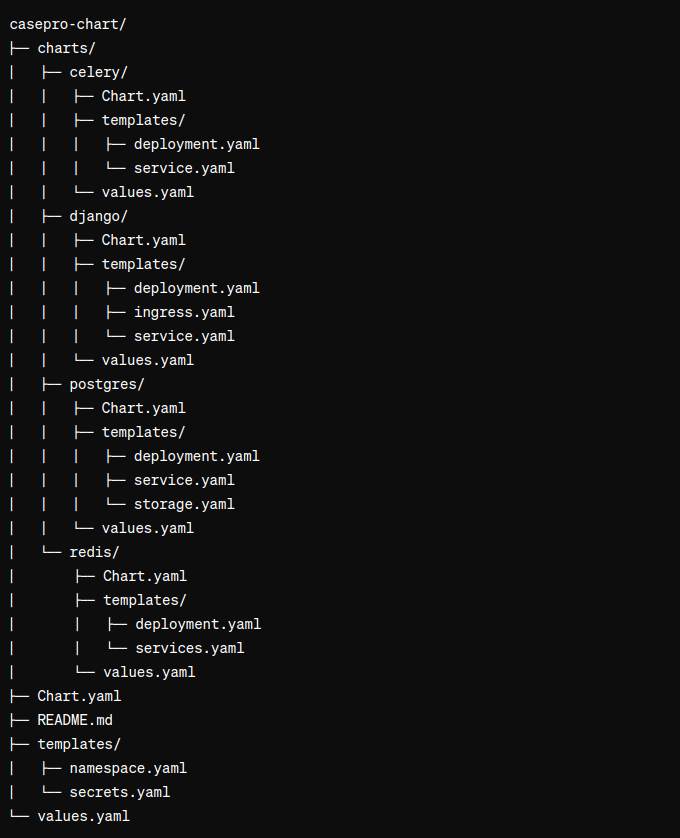
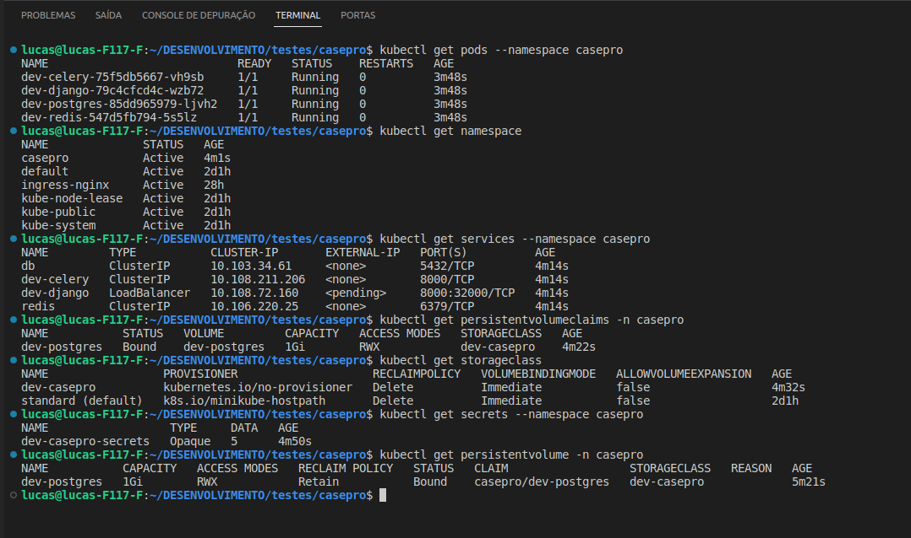

# Serviço CasePro Kubernetes

Este repositório contém as configurações necessárias para executar o serviço CasePro em um ambiente Kubernetes utilizando o Minikube.

## Requisitos

- Helm
- Minikube
- Docker
- kubectl

## Instalação

1. Clone este repositório:

    ```bash
    git clone git@github.com:Lucasbahr/casepro.git
    ```

2. Construa e execute os pods usando o Helm:

    ```bash
    helm install dev ./casepro-chart/
    ```

3. Acesse o serviço CasePro em seu navegador através do seguinte link: [http://casepro.192.168.49.2.nip.io/](http://casepro.192.168.49.2.nip.io/)

## Detalhes da Configuração

### Arquitetura

A pasta `casepor-chart` contém os arquivos de construção da aplicação. Sua arquitetura inclui manifestos Kubernetes para subir as aplicações Celery, Postgres, Django e Redis, assim como a criação do namespace e secrets.



### Configuração

A base do recurso inclui um [secrets.yaml](./templates/secrets.yaml)  para criar um banco de chaves secretas no Kubernetes e um [namespace.yaml](./templates/namespace.yaml) para criar um namespace `casepro`, utilizados por todos os recursos, assim como o [value.yaml](./values.yaml)  que contém configurações globais utilizadas pelos recursos. A imagem [Dockerfile](../Dockerfile) foi construída e enviada para o DockerHub para utilização.

### Django

Para subir o serviço web, foi utilizado um [ingress.yaml](./charts/django/templates/ingress.yaml) para disponibilizar o acesso externo, configurado no IP [http://casepro.192.168.49.2.nip.io/](http://casepro.192.168.49.2.nip.io/) usando [nip.io](https://nip.io/). O [service.yaml](./charts/django/templates/service.yaml) está com LoadBalancer para acesso externo. Dentro do [deployment.yaml](./charts/django/templates/deployment.yaml) está toda a configuração do pod, incluindo o comando de inicialização que executa o [script.sh](../script.sh) para migrar e criar o superusuário conforme documentação do CasePro, assim como as variáveis de ambiente disponibilizadas no [secrets.yaml](./templates/secrets.yaml) . Todas as variáveis estão no arquivo [values.yaml](./charts/django/values.yaml).

### Postgres

O [deployment.yaml](./charts/postgres/templates/deployment.yaml) utiliza uma imagem padrão do serviço disponibilizado no DockerHub, conforme pode ser conferido no [values.yaml](./charts/postgres/values.yaml). O Postgres está com volumes persistentes criados no arquivo [storage.yaml](./charts/postgres/templates/storage.yaml) para garantir a persistência dos dados no banco, e também utiliza as variáveis do [secrets.yaml](./templates/secrets.yaml) . O [service.yaml](./charts/postgres/templates/service.yaml)  está configurado para comunicação interna com ClusterIP.

### Redis

O [deployment.yaml](./charts/redis/templates/deployment.yaml) está configurado de forma padrão. O [service.yaml](./charts/celery/templates/service.yaml) está configurado para comunicação interna com ClusterIP.

### Autoescala

Os deployments do Redis podem ser configurados para autoescalar com base na carga de CPU. É necessário definir as configurações adequadas no arquivo [values.yaml](./charts/redis/values.yaml) e habilitar a seção de `horizontalPodAutoscaler` nos manifestos do Kubernetes.

### Configuração do Django

Vários pontos do arquivo `settings_common.py` foram ajustados para ler as variáveis de ambiente que já estão configuradas em vez de informar os dados diretamente.


## Resultado

