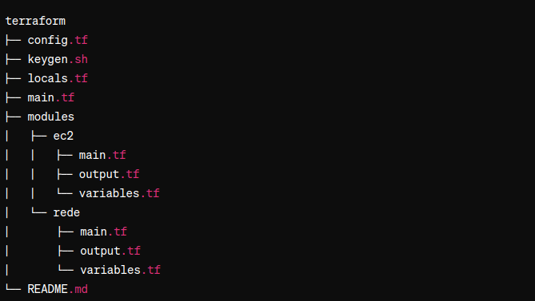
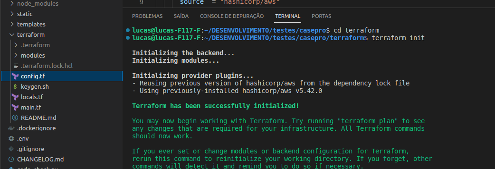
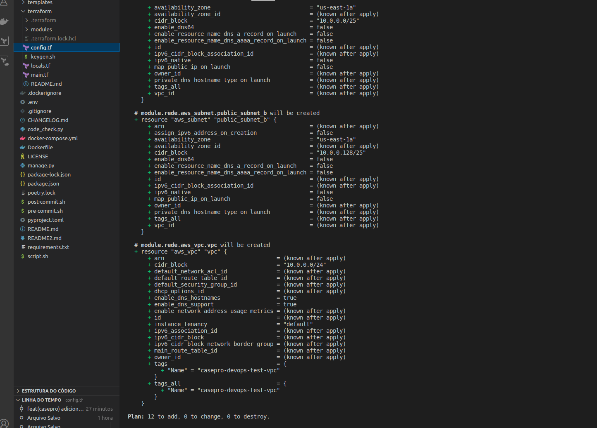

# Subindo Infraestrutura para Serviço Casepro

Este repositório contém as configurações necessárias para subir a infraestrutura utilizando uma VM EC2 da AWS.

## Requisitos

- Terraform
- ssh-keygen

## Instalação

1. Clone este repositório:

    ```bash
    git clone git@github.com:Lucasbahr/casepro.git
    ```

2. Execute o script de geração de chaves SSH:

    ```bash
    cd terraform
    chmod +x keygen.sh
    ./keygen.sh <example@mail.com>
    ```

3. Construa a VM:

    ```bash
    terraform init
    terraform plan
    terraform apply -auto-approve
    ```

    OBS: Caso seja necessário destruir tudo que foi construído:

    ```bash
    terraform destroy
    ```

## Detalhes da Configuração

### Arquitetura

A pasta `terraform` contém os arquivos de construção da aplicação. Sua arquitetura inclui arquivos Terraform separados por módulos com locals e variables.



### Configuração

A configuração depende do arquivo [main.tf](./main.tf) que inicia os dois módulos [redes](./modules/rede/main.tf) e [ec2](./modules/ec2/main.tf). O arquivo [config.tf](./config.tf) contém as configurações de provider e backend para subir o estado da infraestrutura em nuvem. O arquivo [locals.tf](./locals.tf) contém algumas configurações fixas que serão repassadas para variáveis do módulo, mantendo a sinergia entre os componentes. Por fim, o script [keygen.sh](./keygen.sh) gera a chave SSH privada e pública para conseguirmos conectar à VM após construída.
obs: Foi criado o arquivo `~/.aws/credentials`  e adicionado as credenciasi para autenticar no aws

### EC2

O arquivo [ec2](./modules/ec2/main.tf) da VM está construindo uma VM com Linux básico e tipo `t2.micro`, conforme especificado no arquivo [variables.tf](./modules/ec2/variables.tf). Também faz a criação da associação SSH que foi criada pelo [keygen.sh](./keygen.sh).

### Rede

O arquivo [main.tf](./modules/rede/main.tf)  cria a rede que é associada à nossa VM criada pelo [ec2](./modules/ec2/main.tf). A configuração cria uma VPC e depois duas sub-redes que são associadas à VPC, sendo que as sub-redes têm blocos de endereços diferentes seguindo a documentação da AWS. Também cria uma Internet Gateway para que os recursos da VPC tenham acesso à internet. Cria uma tabela de rota e uma associação dessa tabela de rota com as sub-redes e, por fim, cria o roteamento de todo o tráfego de saída do gateway. Também cria grupos de segurança para entradas via SSH ou HTTP na VM.

### Resultado



